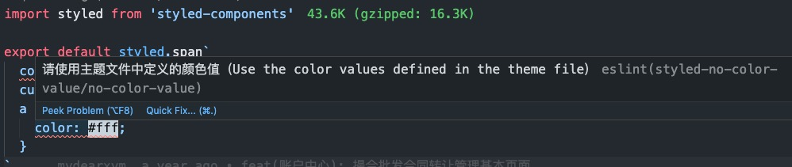

# eslint-plugin-styled-no-color-value

do not allow includes `color` value



## Installation

You'll first need to install [ESLint](http://eslint.org):

```
$ npm install eslint --save-dev
```

Next, install `eslint-plugin-styled-no-color-value`:

```
$ npm install eslint-plugin-styled-no-color-value --save-dev
```

**Note:** If you installed ESLint globally (using the `-g` or `--global` flag) then you must also install `eslint-plugin-styled-no-color-value` globally.

## Usage

Add `this` to the plugins section of your `.eslintrc` configuration file. You can omit the `eslint-plugin-` prefix:

```json
{
  "plugins": ["styled-no-color-value"]
}
```

Then configure the rules you want to use under the rules section.

```json
{
  "rules": {
    "styled-no-color-value/no-color-value": 2
  }
}
```

or

```json
{
  "extends": [
    // other
    "plugin:styled-no-color-value/recommended"
  ]
}
```

## Supported Rules

- no-color-value
